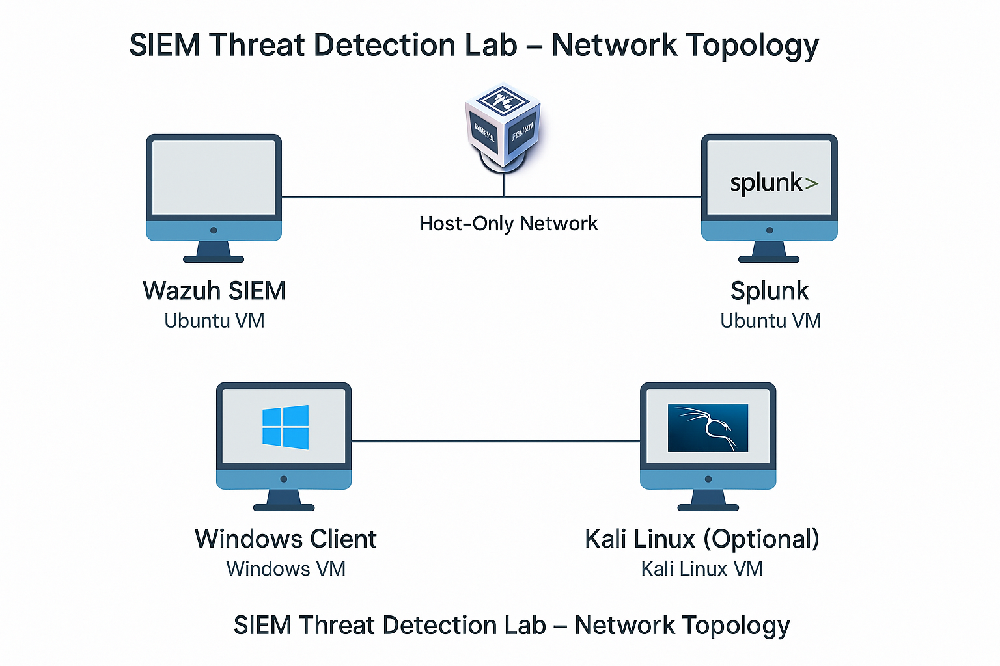

# 🛡️ SIEM Threat Detection Lab – MITRE ATT&CK Simulation & Detection

## Project Overview

This project showcases an end-to-end **SIEM Threat Detection Lab** where **80+ MITRE ATT&CK techniques** are simulated on a Windows environment, and detection is validated using:

**Wazuh SIEM**  
**Splunk**  
**Sysmon + Winlogbeat**  
Realistic detection rules  
Dashboards and logs  

This repository includes everything needed to build, simulate, detect, and validate a hands-on detection engineering lab.

---

## Lab Architecture

| Component          | Role                              | OS / Version         |
|--------------------|-----------------------------------|----------------------|
| Wazuh SIEM Server  | Log collection, detection rules    | Ubuntu 22.04 LTS     |
| Splunk Server      | Log aggregation, dashboards        | Ubuntu 22.04 LTS     |
| Windows 10 Client  | Attack simulation, log source      | Windows 10 Pro       |
| Kali Linux (Optional) | Advanced attack simulation     | Kali Rolling         |

---

## Tools Used

| Tool            | Purpose                              | Location           |
|-----------------|---------------------------------------|--------------------|
| Sysmon          | Event logging (process, network, file) | Windows Client     |
| Winlogbeat      | Log forwarding to Wazuh/Splunk        | Windows Client     |
| Wazuh           | SIEM detection, alerts                | Wazuh Server       |
| Splunk          | Log aggregation, detection rules      | Splunk Server      |
| PowerShell      | Attack simulation scripts             | Windows Client     |
| Mimikatz        | Credential dumping simulation (T1003) | Windows Client     |
| Atomic Red Team | MITRE techniques simulation guide     | attack-simulations/atomic_red_team_simulations.md |

For a detailed list, see [`lab-setup/tools_used.md`](lab-setup/tools_used.md).

---

## Repository Structure

siem-threat-detection-lab/
├── README.md
├── lab-setup/
│ ├── vm_config.md
│ ├── network_topology.png
│ └── tools_used.md
├── attack-simulations/
│ └── atomic_red_team_simulations.md
├── detection-rules/
│ ├── wazuh_detection_rules.xml
│ └── splunk_detection_rules.md
├── logs/
│ ├── example_wazuh_alert.json
│ └── splunk_alerts_export.csv

---

## How to Set Up the Lab

### Deploy Virtual Machines

Follow [`lab-setup/vm_config.md`](lab-setup/vm_config.md) for VM specs and setup.

### Install & Configure Components

| Component    | Setup Overview                                |
|--------------|-------------------------------------------------|
| Sysmon       | Install + SwiftOnSecurity config               |
| Winlogbeat   | Forward Sysmon and Event Logs to Wazuh/Splunk   |
| Wazuh        | Install + load [`wazuh_detection_rules.xml`](detection-rules/wazuh_detection_rules.xml) |
| Splunk       | Install + load [`splunk_detection_rules.md`](detection-rules/splunk_detection_rules.md) |
| Kibana       | Optional: Use for Wazuh dashboards              |

### Simulate Attacks

Run simulations from [`attack-simulations/atomic_red_team_simulations.md`](attack-simulations/atomic_red_team_simulations.md) on the Windows machine.

### Validate Detections

- Alerts in Wazuh: `/var/ossec/logs/alerts/alerts.json`
- Alerts in Splunk: Search UI, dashboards

---

## Expected Outputs

MITRE ATT&CK detection coverage  
Logs from Sysmon forwarded to Wazuh/Splunk  
Triggered alerts for techniques like credential dumping, obfuscated PowerShell  
Dashboards in Wazuh and Splunk  
Final report summarizing results

---

## Important Notes

- This lab is for **educational purposes only**.
- **Do not use offensive tools like Mimikatz in production**.
- Always isolate the lab network.

---

## Credits

Created by Arun Saravanakumar as part of a hands-on cybersecurity learning project with MITRE ATT&CK, Wazuh, Splunk, Sysmon, and Atomic Red Team.

